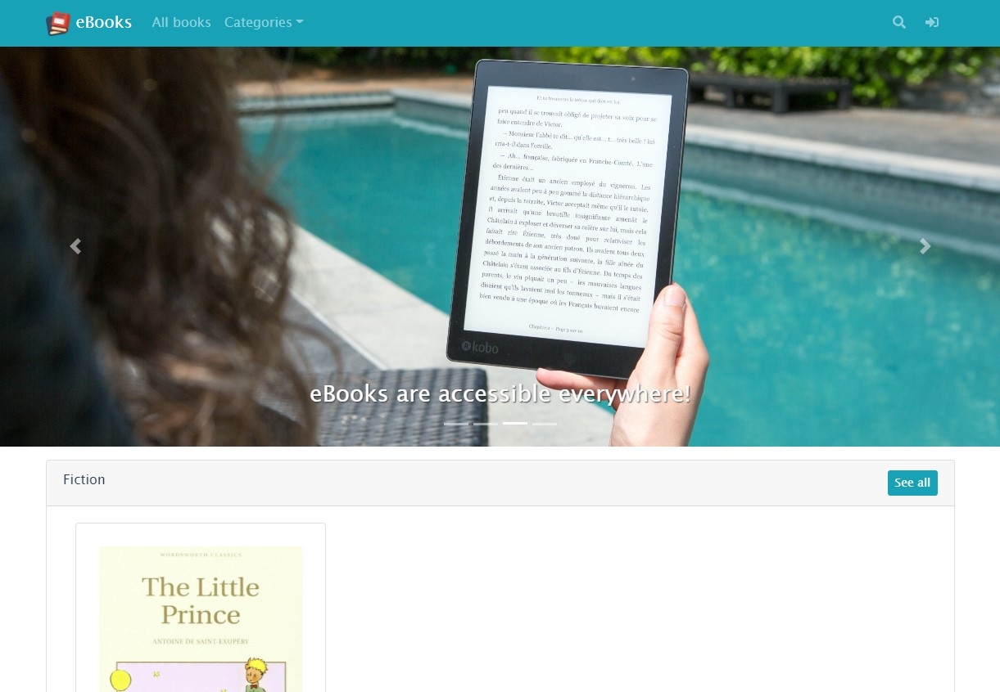
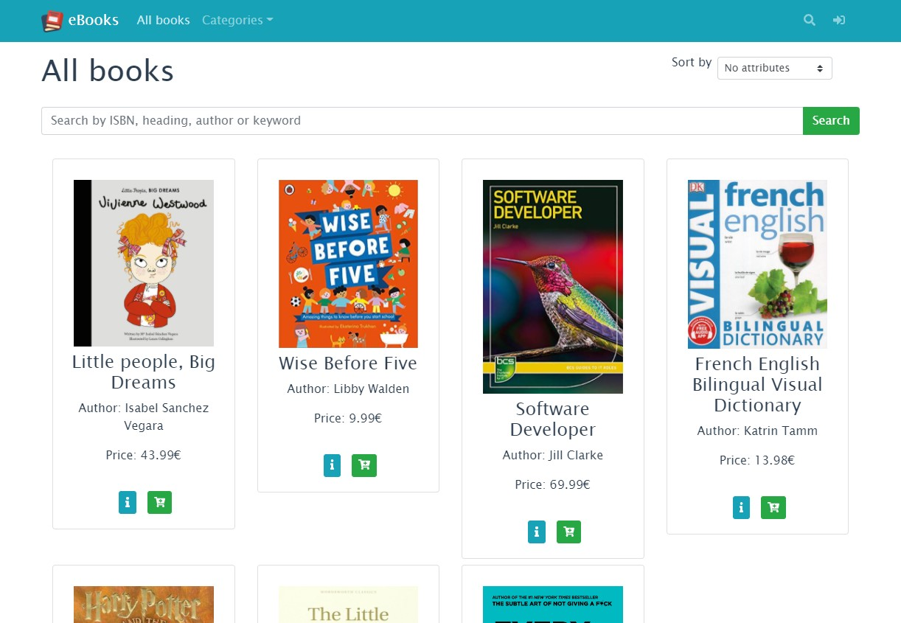
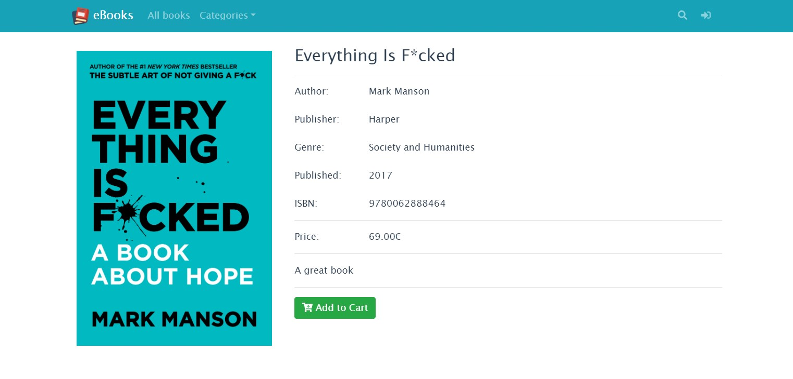
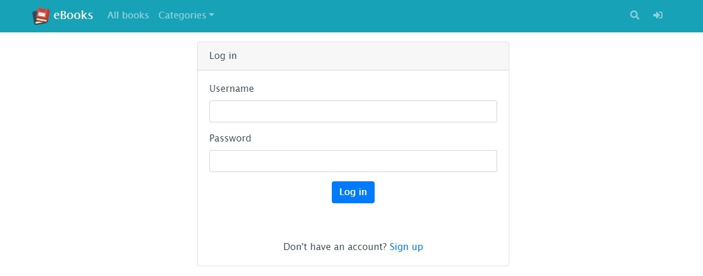
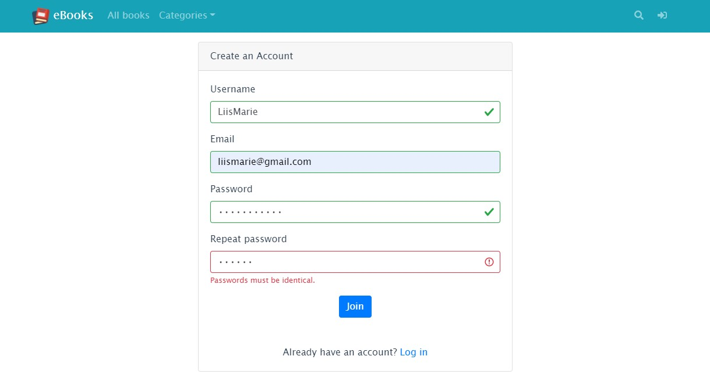
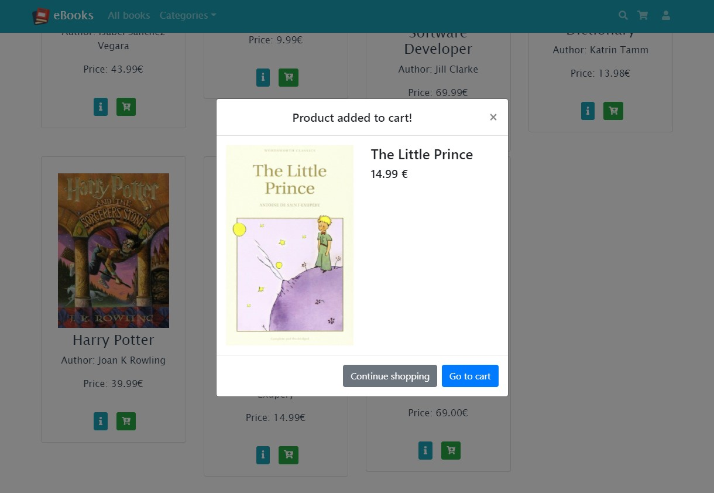
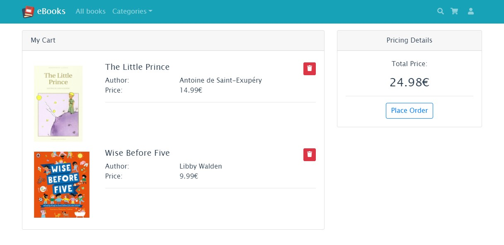
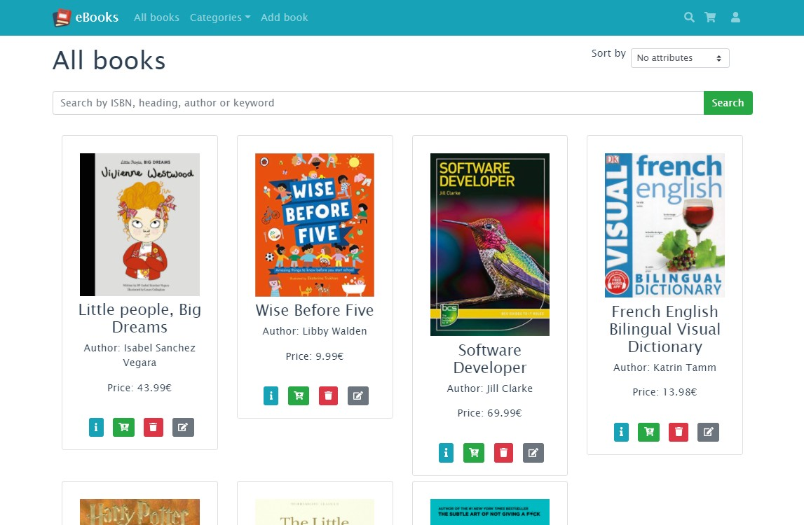
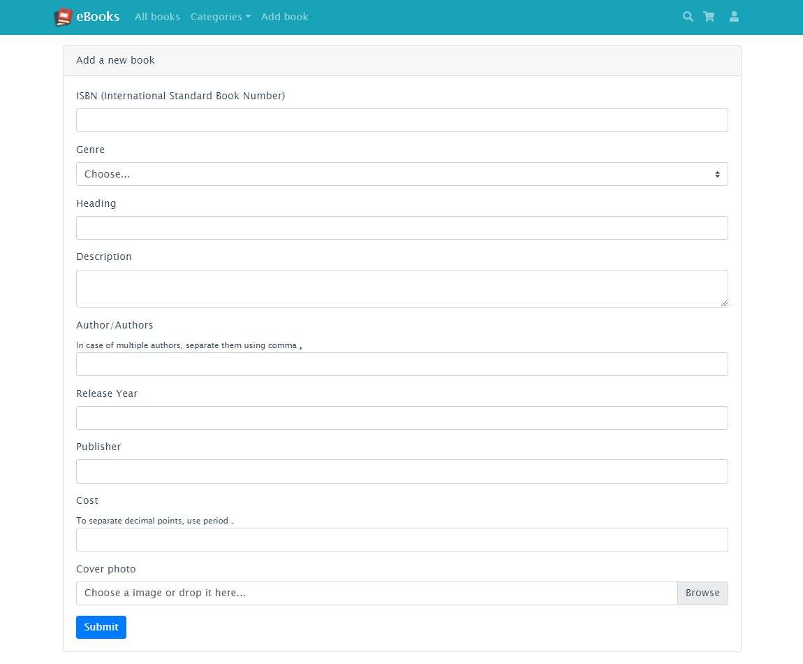

# BookStore - frontend

Team members - Rait Kulbok, Liis-Marie Kütt, Boriss Zahharov

User stories:
* As a guest I can see all books, and their detailed descriptions.
* As a guest I can search for books by title, author, keyword and ISBN.
* As a guest I can sort books by price.
* As a guest I can see books displayed by genre.
* As a guest I can create an account.
* As a guest I can log in to an existing account.
* As a user I can do all the things that guests can do.
* As a user I can add products to the shopping cart and see confirmation that it was successful.
* As a user I can see the content of my cart and remove unwanted items from there.
* As a user I can place the order and see a confirmation that my purchase was successful.
* As an admin I can see, add, remove and edit books.
* As an admin and user I can log out from my account.

[More about the project](https://rakulb.pages.taltech.ee/iti0203-team11-website/index.html)

## Get backend up and running
[Clone backend from here](https://github.com/Borzah/bookstore?fbclid=IwAR3A-r9mcheXDXncYkC2qKt_ffMyLlEYIQDLtL_PL-sXfjppS6RjXOb2Cp0)

## Project setup
###### NB! Vue is globally installed.

### Download package and its dependencies

```
npm install
```

### Compiles and hot-reloads for development
```
npm run serve
```

### Port

App runs on http://localhost:4200/

### Compiles and minifies for production
```
npm run build
```

### Lints and fixes files
```
npm run lint
```

### Customize configuration
See [Configuration Reference](https://cli.vuejs.org/config/).

<br/>

## Screenshots

Home page |
------------ |
 |

All books |
------------ |
 |

Book detail |
------------ |
 |

Login |
------------ |
 |

Register |
------------ |
 |

Book added to cart |
------------ |
 |

Cart |
------------ |
 |

All books (logged in as admin) |
------------ |
 |

Add new book (logged in as admin) |
------------ |
 |

See more in **screenshots** folder.
